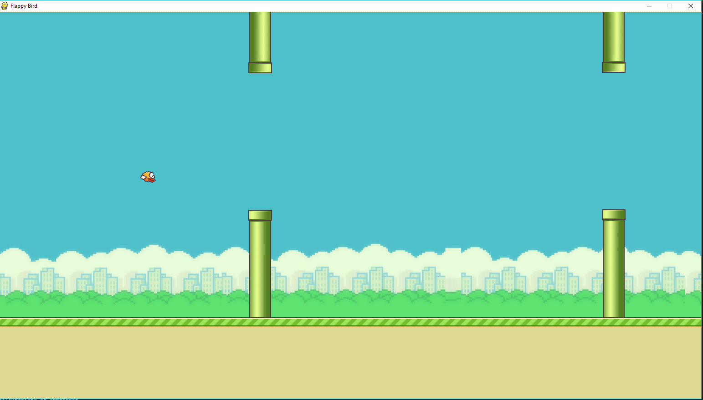

FlappyBirdClone
===============

A Flappy Bird Clone made using [python-pygame][1]
This altered version is a researchedition for HCI performance monitoring. 

How-to
------

1. Install Python 2.7.X or 3.5.x from [here](https://www.python.org/download/releases/)

2. Install PyGame 1.9.X from [here](http://www.pygame.org/download.shtml)

3. Clone this repository: `git clone https://github.com/sourabhv/FlappyBirdClone.git` or click `Download ZIP` in right panel and extract it.

4. Run `python flappy.py` from the repo's directory

5. use <kbd>&uarr;</kbd> or <kbd>Space</kbd> key to play and <kbd>Esc</kbd> to close the game.

  (Note: Install pyGame for same version python as above)

  (For x64 windows, get exe [here](http://www.lfd.uci.edu/~gohlke/pythonlibs/#pygame))

ScreenShot
----------

[1]: http://www.pygame.org

Variable inputs
----------
These variables, along with the timestamps, can be used to identify the dataset in a between-group, between-subject analysis.
Participant identifier, SPILLER = "00"
Input method, MODUS = "Headset"
Independent variable, GROUP = "P"
